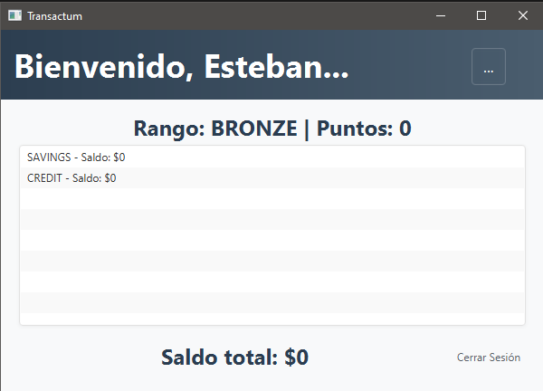
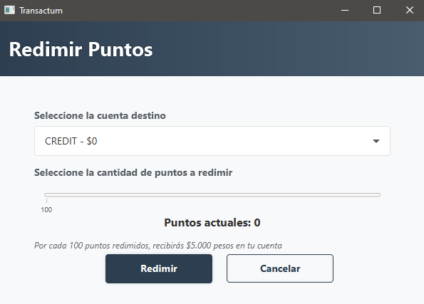

# Transactum - Virtual Wallet with Points System

## Overview

Transactum is a Java application that simulates a virtual wallet with an integrated points system. The project allows you to manage users with multiple accounts, perform deposit, withdrawal, and transfer operations, schedule automatic transactions, and track user points. The application is built with JavaFX following the MVC pattern, and all data structures (lists, queues, stacks, trees, graphs, and hash tables) are implemented from scratch.




## Features

* **User and Account Management**: Each user can have multiple accounts, managed through `User`, `Account`, and `AccountService` classes.
* **Manual and Scheduled Transactions**: Perform instant or scheduled deposits, withdrawals, and transfers.
* **Points and Ranks System**: Earn points for every transaction and automatically update user rank (`UserRank`).
* **Custom Data Structures**: Handcrafted implementation of lists, queues, stacks, trees, graphs, and hash tables without using Java's built-in collections.
* **Dynamic JavaFX Interface**: Utilizes `ComboBox` for user selection and `TableView` to display account details.

## Requirements

* JDK 17 or higher
* JavaFX 17 or higher
* Maven or Gradle (optional for dependency management)

## Setup

1. Clone the repository to your local machine:

   ```bash
   git clone https://github.com/your_username/Transactum.git
   cd Transactum
   ```
2. Build the project:

   * With Maven:

     ```bash
     mvn clean install
     ```
   * With Gradle:

     ```bash
     gradle build
     ```
3. Open the project in your preferred IDE (IntelliJ IDEA, Eclipse, NetBeans) and configure JavaFX.
4. Run the application:

   * With Maven:

     ```bash
     mvn javafx:run
     ```
   * Directly:

     ```bash
     java --module-path /path/to/javafx/lib --add-modules javafx.controls,javafx.fxml -jar target/Transactum.jar
     ```

## Usage

1. Launch the application.
2. Select a preloaded user from the **ComboBox**.
3. View the user's accounts in the **TableView**.
4. Perform deposits, withdrawals, or transfers and observe the changes in balance and points.

## Code Structure

* **`App.java`**: Entry point of the application, launches the JavaFX UI.
* **`controller/`**

  * `MainController.java`: Handles UI events and navigation.
* **`model/`**

  * `User.java`, `Account.java`, `Transaction.java`, `UserRank.java`
* **`service/`**

  * `AccountService.java`: Business logic for account operations.
  * `AuthService.java`: Input validation for login and signup forms.
* **`dao/`**

  * `UserDAO.java`, `AccountDAO.java`: Data access and persistence.
* **`dto/`**

  * `UserDTO.java`, `AccountDTO.java`: Data transfer objects.
* **`datastructures/`**

  * Custom data structures (lists, stacks, queues, trees, graphs, hash tables).

## License

This project is licensed under the **MIT License**. See the [LICENSE](LICENSE) file for details.

---

*Developed by Esteban Gómez and Jacobo Villa, University of Quindío*